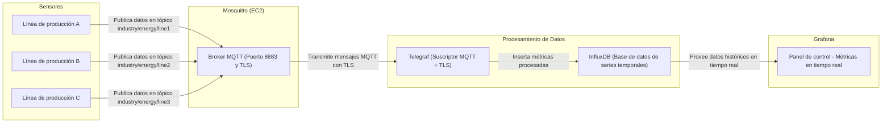

# Datos

Nombre: Alexis Sebastian Sanchez Ruano

Número de control: 22211659

Fecha: 19 de Octubre del 2025

Nickname: SanchezRuano22211659

# Medición de consumo energético industrial

Proyecto que busca simular la medición del consumo energético de 3 líneas de producción ficticias representadas por tres sensores.

Los datos serán recibidos a través de MQTT y guardados en influxdb para ser representados en Grafana.

Cada sensor medirá los siguientes datos:
- El identificador del sensor
- Hora en la que se envió
- La tensión eléctrica medida
- La corriente eléctrica
- La potencia instantánea
- La energía acumulada a lo largo del tiempo
- La temperatura del equipo

# Arquitectura

## Sensores

Un sensor es representado por un raspberry PI con el código de ejecución para su simulación. El código está trabajado el Rust, generando los datos mencionados y enviando los datos a Mosquitto en su respectivo tópico.

## Mosquitto

Mosquitto es ejecutado en EC2 como el servidor principal, recibiendo los datos de los sensores y posteriormente siendo interceptados por Telegraf.

## Telegraf

Telegraf es encargado de intrceptar los datos publicados por Mosquitto y traducirlos para su inserción en InfluxDB, todo por medios seguros de TLS.

## InfluxDB

InfluxDB guarda todos los datos recibidos de Telegraf de manera consistente y segura.

## Grafana

Es el encargado de usar los datos de InfluxDB para mostrar de manera visual la información, midiendo las métricas de manera casi inmediata.

## Diagrama de la arquitectura general

# Procedimiento
# Pruebas
