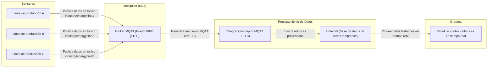

# Datos

Nombre: Alexis Sebastian Sanchez Ruano

Número de control: 22211659

Fecha: 19 de Octubre del 2025

Nickname: SanchezRuano22211659

# Medición de consumo energético industrial

Proyecto que busca simular la medición del consumo energético de 3 líneas de producción ficticias representadas por tres sensores.

Los datos serán recibidos a través de MQTT y guardados en influxdb para ser representados en Grafana.

Cada sensor medirá los siguientes datos:
- El identificador del sensor
- Hora en la que se envían los datos
- La tensión eléctrica medida
- La corriente eléctrica
- La potencia instantánea
- La energía acumulada a lo largo del tiempo
- La temperatura del equipo

# Arquitectura

## Sensores

Un sensor es representado por un raspberry PI con el código de ejecución para su simulación. El código está trabajado el Rust, generando los datos mencionados y enviando los datos a Mosquitto en su respectivo tópico.

## Mosquitto

Mosquitto es ejecutado en EC2 como el servidor principal, recibiendo los datos de los sensores y posteriormente siendo interceptados por Telegraf.

## Telegraf

Telegraf es encargado de intrceptar los datos publicados por Mosquitto y traducirlos para su inserción en InfluxDB, todo por medios seguros de TLS.

## InfluxDB

InfluxDB guarda todos los datos recibidos de Telegraf de manera consistente y segura.

## Grafana

Es el encargado de usar los datos de InfluxDB para mostrar de manera visual la información, midiendo las métricas de manera casi inmediata.

## Diagrama de la arquitectura general



# Procedimiento

[Instalacion inicial](https://asciinema.org/a/uspNibspVMZJR6tLNBVAgX4BO)

# Pruebas

[Prueba inicial del dashboard](https://www.loom.com/share/69a5d33da5864d1e9c16420d36b75e8b?sid=cff58493-1e7d-4c0d-a73f-fdc059822c71)

---

# Códigos

## Simulador del medidor de energía

```Rust
use rumqttc::{MqttOptions, AsyncClient, QoS, Transport};
use tokio::{task, time};
use serde::Serialize;
use rand::Rng;
use std::time::Duration;
use std::fs;
use std::env;

//Estructura de los datos
#[derive(Serialize, Debug)]
struct EnergyData {
    device_id: String,
    voltage: f32,
    current: f32,
    power: f32,
    energy: f32,
    power_factor: f32,
    timestamp: u64,
}

// Proceso principal
#[tokio::main]
async fn main() {
    //Recoleccion de los valores iniciales desde la consola
    let args: Vec<String> = env::args().collect();
    if args.len() < 3 {
        eprintln!("Uso: {} <device_id> <topic>", args[0]);
        eprintln!("Ejemplo: {} rust-energy-sensor-01 industrial/energy/linea1", args[0]);
        return;
    }
    let device_id = args[1].clone();
    let topic = args[2].clone();

    println!("Iniciando sensor energético '{}'", device_id);
    println!("Publicando en topico '{}'", topic);

    // Conexion inicial a través de TLS(8883)
    let mqtt_host = "100.118.141.104";
    let mqtt_port = 8883;

    let mut mqtt_options = MqttOptions::new(&device_id, mqtt_host, mqtt_port);
    mqtt_options.set_keep_alive(Duration::from_secs(5));

    // Se lee el certificado para el permiso
    let ca_file_path = "/home/pi/Documents/ca.crt";
    let ca_cert = match fs::read(ca_file_path) {
        Ok(cert) => cert,
        Err(e) => {
            eprintln!("Error al leer el archivo del certificado CA '{}': {}", ca_file_path, e);
            return;
        }
    };
    let transport = Transport::tls(ca_cert, None, None);
    mqtt_options.set_transport(transport);

    // Se da la conexion usando los datos iniciales, en este caso 
    // unicamente el certificado 
    let (client, mut eventloop) = AsyncClient::new(mqtt_options, 10);

    let topic_clone = topic.clone();
    let device_id_clone = device_id.clone();

    // Proceso para iniciar el envio de datos a MQTT
    task::spawn(async move {
        publish_energy_data(client, topic_clone, device_id_clone).await;
    });

    // Bucle para mantener enviando los datos mientras sea posible
    loop {
        match eventloop.poll().await {
            Ok(notification) => println!("[{}] MQTT => {:?}", device_id, notification),
            Err(e) => {
                eprintln!("[{}] Error en bucle MQTT: {:?}", device_id, e);
                time::sleep(Duration::from_secs(1)).await;
            }
        }
    }
}

async fn publish_energy_data(client: AsyncClient, topic: String, device_id: String) {
    let interval = Duration::from_secs(5);
    let mut total_energy: f32 = 0.0;

    loop {
        time::sleep(interval).await;

        let voltage: f32 = rand::thread_rng().gen_range(210.0..240.0);
        let current: f32 = rand::thread_rng().gen_range(5.0..20.0);
        let power_factor: f32 = rand::thread_rng().gen_range(0.8..1.0);
        let power = voltage * current * power_factor;

        // Usando los datos acumulados, se mide la energia acumulada
        total_energy += (power * (interval.as_secs_f32() / 3600.0)) / 1000.0;

        let data = EnergyData {
            device_id: device_id.clone(),
            voltage: (voltage * 100.0).round() / 100.0,
            current: (current * 100.0).round() / 100.0,
            power: (power * 100.0).round() / 100.0,
            energy: (total_energy * 1000.0).round() / 1000.0,
            power_factor: (power_factor * 100.0).round() / 100.0,
            timestamp: std::time::SystemTime::now()
                .duration_since(std::time::UNIX_EPOCH)
                .unwrap()
                .as_secs(),
        };

        let payload = serde_json::to_string(&data).unwrap();
        println!("[{}] {}", device_id, payload);

        match client.publish(&topic, QoS::AtLeastOnce, false, payload.as_bytes()).await {
            Ok(_) => println!("[{}] Publicado correctamente", device_id),
            Err(e) => eprintln!("[{}] Error al publicar: {:?}", device_id, e),
        }
    }
}
```

## Configuración de Telegraf

```
[[inputs.mqtt_consumer]]
  ## Dirección del broker MQTT
  servers = ["ssl://100.118.141.104:8883"]

  tls_ca = "/etc/mosquitto/certs/ca.crt"

  topics = ["industry/energy/+"]

  ## Formato de los mensajes JSON
  data_format = "json"

  ## Origen del sensor
  tag_keys = ["device_id"]

[[outputs.influxdb_v2]]
  urls = ["http://127.0.0.1:8086"]
  token = "***"
  organization = "iot-lab"
  bucket = "sensores"
```

## Configuración de Mosquitto

```
listener 8883
cafile /etc/mosquitto/certs/ca.crt
certfile /etc/mosquitto/certs/server.crt
keyfile /etc/mosquitto/certs/server.key
require_certificate false
allow_anonymous true
```
